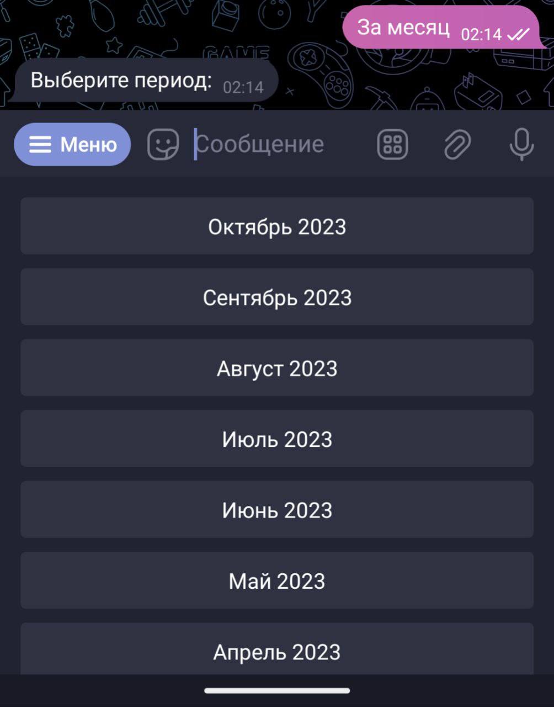
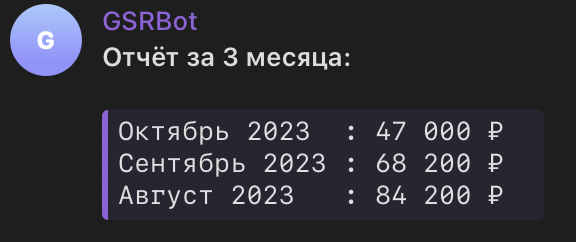

# GSR Bot

## Команды

Список команд:

* `/query` – Посмотреть записи (отчёты)
* `/add` – Добавить запись (вручную)
* `/check_new` – Проверить новые записи (в telegraph)
* `/backup` – Получить dump базы данных в CSV формате

### Посмотреть записи (`/query`)

Показывает отчёты:

* Последние события
* За месяц
* Потрачено по месяцам
* Потрачено по категориям

Подробности:

Последние события

Выводит последние события по категориям:

* Сессия
* Диагностика
* Ранговая сессия
* Ранговая сессия в СЧ1
* Ранговая сессия в СЧ2 (если есть)
* Продукт GSR
* Оплата экспертного
* Оплата 1+ <mark style="background-color:orange;">нужно убрать</mark>

Пример отчёта:

.png>)

<pre class="language-markdown"><code class="lang-markdown"><strong>**Последняя сессия:**
</strong>24.10.2023 1PRO (из диагностики), 2 600 ₽

**Последняя диагностика:**
23.10.2023 Диагностика на 2 модуль

**Последняя ранговая:**
31.05.2023 Ранг, 5 000 ₽

**Последняя ранговая в СЧ1:**
11.10.2023 Ранговая в СЧ1 – 5, 8 000 ₽

**Последний продукт GSR:**
01.09.2023 1 модуль с ДУ, 14 000 ₽

**Оплата экспертного:**
01.09.2023 Сентябрь 2023, 10 000 ₽

**Оплата 1+:**
01.08.2023 Август 2023, 4 000 ₽
</code></pre>

За месяц

Предлагает выбрать период и выводит список всех месяцев:

В отчёте за месяц траты по категориям (название, кол-во трат из этой категории, потраченная сумма на категорию) и всего.

Пример отчёта:

<pre class="language-markdown"><code class="lang-markdown">**Отчёт за Сентябрь 2023:**

**Сессия** (17): 44 200 ₽
**Диагностика** (1): 0 ₽
**Продукт GSR** (1): 14 000 ₽
**Сопровождение** (1): 10 000 ₽
**ПГ1** (1): 0 ₽

<strong>**Всего потрачено**: 68 200 ₽
</strong></code></pre>

Потрачено по месяцам

Предлагает выбрать период:&#x20;

* текущий месяц
* 3 месяца
* 6 месяцев
* год
* указать вручную (0 – текущий месяц, 1 – текущий + предыдущий месяц...)

После выбора периода нужно выбрать форму отчета:

* короткая (только общая сумма по месяцам)
* подробная (общая сумма по месяцам + траты по категориям)

Пример короткого отчета за 3 месяца (с октября 2023):

Пример подробного отчета за 3 месяца (с октября 2023):

.png>)

Потрачено по категориям

Выводит общую сумму трат по категориям (название категории, кол-во трат в ней и сумма трат на категорию) и всего потрачено.

Пример отчёта:

<pre class="language-markdown"><code class="lang-markdown"><strong>**Отчёт по категориям:**
</strong>
**Сессия** (26): 10 000 ₽
<strong>**ПГ1** (1): 0 ₽
</strong>**Сопутствующие расходы** (2): 12 000 ₽
**Продукт GSR** (8): 50 000 ₽
**ПГ2** (1): 0 ₽
**Сопровождение** (11): 110 000 ₽
**Подписка 1+** (6): 24 000 ₽
**Диагностика** (18): 12 000 ₽
**Самосессия** (3): 0 ₽
**Подключение к истоку** (2): 150 000 ₽

**Всего потрачено**: 368 000 ₽
</code></pre>

